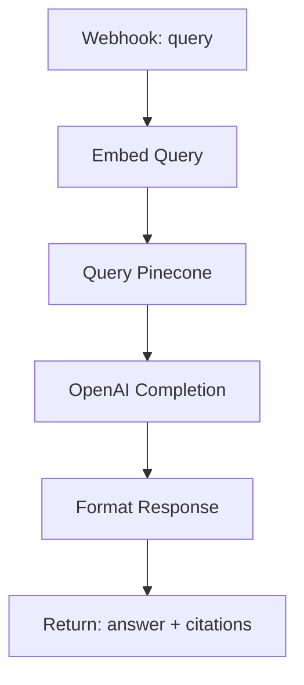

# RAG Retrieval with Citations

## What It Does

This workflow implements a retrieval-augmented generation (RAG) pipeline. It takes a user query, embeds it, retrieves similar documents from a vector database, and generates an answer that cites the source material. Perfect for knowledge base queries where attribution matters.

## Why It's Architecturally Interesting

RAG solves the hallucination problem by grounding responses in real data. This workflow demonstrates how to wire embeddings (OpenAI), vector search (Pinecone), and completion in a chain. The citation layer ensures answers are traceable to their sources, critical for trust.

## Node by Node

1. **Webhook In**: Accepts JSON with a `query` field.
2. **Embed Query**: Uses OpenAI's text-embedding-3-small to vectorize the query.
3. **Query Pinecone**: Sends the embedding to Pinecone, retrieves top-5 matches with metadata.
4. **OpenAI Completion**: Sends the query and context to GPT-4o-mini with a system prompt that enforces citation format.
5. **Format Response**: Extracts the answer text and wraps the matched documents for the caller.

## Architecture Diagram



## Swap This For Your Stack

- **Pinecone** is the vector DB. Swap for Weaviate, Milvus, pgvector (Postgres), or even a simple BM25 index if your corpus is small (under 10k docs).
- **OpenAI Embeddings** can be replaced with Cohere, Anthropic's API, or open models (sentence-transformers).
- **GPT-4o-mini** for completion can be swapped for Claude, Gemini, or any API-compatible model.
- For **on-premise**: Use Ollama or vLLM locally instead of calling cloud APIs.

## Cost Optimization Tips

- Use `text-embedding-3-small` (cheap, good quality) for vector generation.
- Cache embeddings in Redis or a local DB to avoid re-embedding identical queries.
- Limit Pinecone results to top-5 to reduce token spend in the completion step.
- Consider batch embedding updates to your knowledge base during off-peak hours.

## Testing

Send a POST to the webhook with:
```json
{"query": "How do I reset my password?"}
```

Expect back:
```json
{
  "answer": "To reset your password, go to Settings > Security and click [Source: help-docs-001]. ...",
  "citations": [...]
}
```
