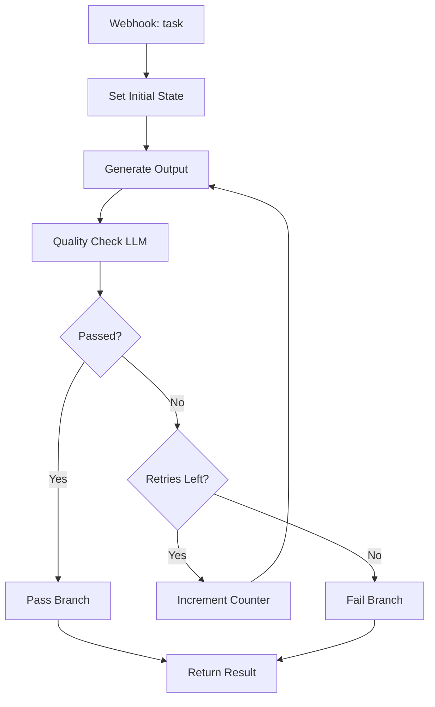

# Self-Correcting Agent

## What It Does

This agent generates output, evaluates its own quality using an LLM judge, and retries up to 2 times if quality falls below a threshold. The loop terminates on pass or after max attempts, returning the best result with metadata on how many iterations it took.

## Why It's Architecturally Interesting

Self-correction shifts quality responsibility from a single pass to an iterative refinement loop. By having the model critique its own work, you often get better results than a single shot. This pattern works well for structured output (JSON, code, lists) where quality is deterministic.

## Node by Node

1. **Webhook In**: Accepts JSON with a `task` field.
2. **Set Initial State**: Initializes `attempt` counter and `max_attempts` (3).
3. **Generate Output**: First LLM call to complete the task.
4. **Quality Check**: Second LLM call acts as judge. Evaluates the output, returns JSON with score and pass/fail.
5. **Check Quality Gate**: If-node routes to pass or retry branch.
6. **Pass Branch**: Output passed, return immediately with attempt count.
7. **Retry Check**: If attempts remain, increment and loop back. Otherwise, fail.
8. **Increment and Retry**: Update attempt counter and modify task with feedback.

## Architecture Diagram



## Swap This For Your Stack

- Replace GPT-4o-mini with Claude 3.5 Sonnet (better at self-critique) or Gemini 2.0 Flash.
- Scoring threshold (default 7/10) is tunable. Adjust down for less strict eval, up for perfectionist gates.
- Instead of LLM judge, use a classifier model if evaluating against a fixed rubric (faster, cheaper).
- Log all iterations to a database to track where outputs fail most often.

## Cost Optimization Tips

- Use a cheap, fast model (gpt-3.5-turbo) for generation; reserve expensive model for judge role if budget permits.
- Set max_attempts to 2 (diminishing returns after 2 retries for most tasks).
- Cache the quality check prompt to avoid token bloat.
- Only enable self-correction for high-stakes tasks. Use single-pass generation for low-risk outputs.

## Testing

Send a POST with:
```json
{"task": "List 5 benefits of n8n workflows"}
```

Expect back:
```json
{
  "final_output": "1. Automation... 2. Integration... [etc]",
  "status": "passed",
  "attempts_used": 1
}
```

If quality fails, you'll see `attempts_used: 2` or `3` before passing or hitting the max.
