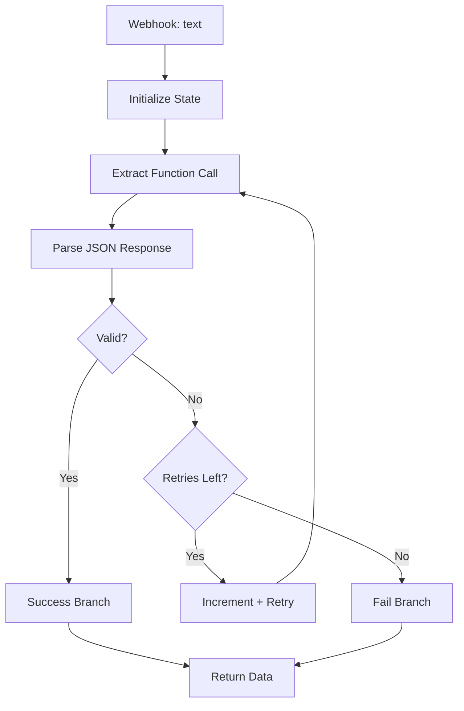

# Structured Extraction with Retry

## What It Does

This workflow extracts structured JSON from unstructured text using function calling. If the output fails schema validation, it retries up to 2 times, feeding the validation error back to the model as feedback for the next attempt.

## Why It's Architecturally Interesting

Function calling is a game-changer for extraction because it guarantees schema compliance (or fails loudly). This workflow pairs that with a retry loop that closes the feedback loop. The model sees "invalid: missing email field" and learns to extract better. Beats regex extraction by orders of magnitude for messy text.

## Node by Node

1. **Webhook In**: Accepts JSON with a `text` field containing unstructured data.
2. **Initialize State**: Sets up `retry_count` and `last_error` fields.
3. **Extract Function**: Calls GPT-4o-mini with function calling, targeting schema: name, email, phone, address.
4. **Parse JSON**: Code node attempts to parse the response as JSON and validate required fields.
5. **Check Validation**: If-node branches on parse error.
6. **Success Branch**: JSON valid, return extracted data.
7. **Check Retries**: If error and retries remain, increment counter and loop.
8. **Retry Increment**: Update retry count and pass the error message back to the LLM.
9. **Fail Branch**: Max retries exceeded, return null with error message.

## Architecture Diagram



## Swap This For Your Stack

- Replace OpenAI function calling with Anthropic's tool use, Claude excels at this.
- For Gemini, use Gemini 2.0 Flash with structured output schemas.
- Instead of code node for validation, use a JSON schema validator node if available in n8n.
- Swap function calling entirely for prompt engineering if your LLM doesn't support it (harder, less reliable).

## Cost Optimization Tips

- Use GPT-3.5-turbo for extraction if budget is tight; function calling is supported.
- Cache the schema definition in the prompt to avoid token reuse.
- Batch multiple extraction requests into one API call if processing bulk data.
- Log failures to a database to identify patterns (missing fields, malformed text types) and refine the prompt.

## Testing

Send a POST with:
```json
{"text": "John Doe, john@example.com, 555-1234, 123 Main St"}
```

Expect back on first pass:
```json
{
  "extracted_data": {"name": "John Doe", "email": "john@example.com", ...},
  "status": "success"
}
```

If text is messy and extraction fails once, you'll see a retry with error feedback passed to the model.
