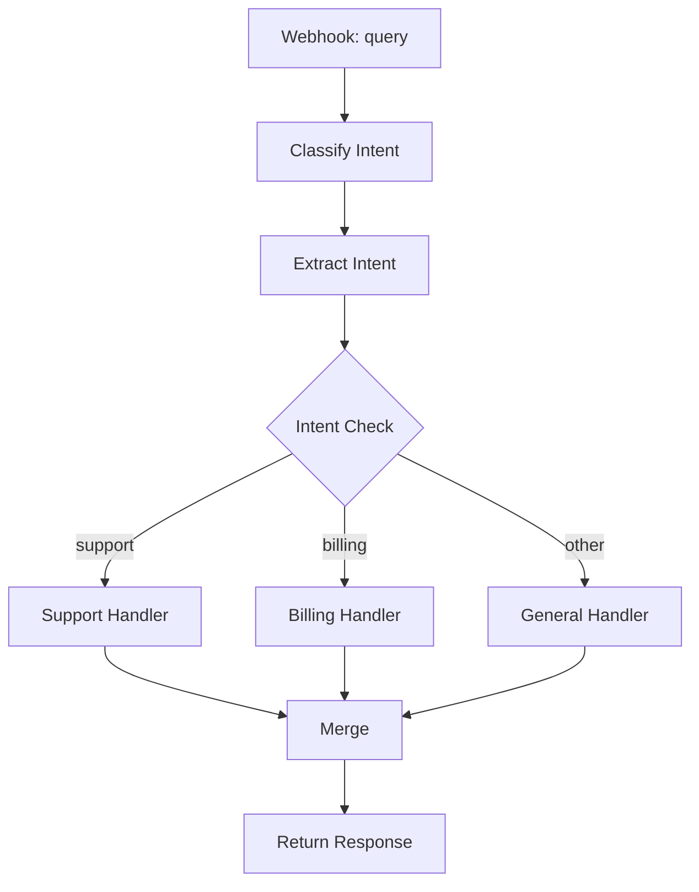

# LLM Router

## What It Does

This workflow classifies user queries into intents (support, billing, technical, general) using a cheap, fast LLM (GPT-3.5-turbo). It then routes to specialized sub-workflows, each tuned with a different system prompt and temperature. A final merge node collects all responses.

## Why It's Architecturally Interesting

The router pattern decouples classification from execution. By using an ultra-cheap classifier to route to specialized handlers, you save money and improve quality. Each handler can be tuned for its domain. This is how production support systems scale from one chatbot to many domain-expert agents.

## Node by Node

1. **Webhook In**: Accepts JSON with a `query` field.
2. **Classify Intent**: Calls GPT-3.5-turbo (cost: ~$0.0005) to classify the intent.
3. **Extract Intent**: Parses the classification result (trim, lowercase).
4. **Route Gate**: First if-node checks if intent is "support".
5. **Support Handler**: GPT-4o-mini with support specialist prompt (temperature 0.5).
6. **Check Billing**: Second if-node checks for "billing" intent.
7. **Billing Handler**: GPT-4o-mini with billing expert prompt (temperature 0.3, very precise).
8. **General Handler**: Fallback for all other intents (temperature 0.7, creative).
9. **Merge**: Collects responses from all branches.

## Architecture Diagram



## Swap This For Your Stack

- Replace GPT-3.5-turbo with Claude 3.5 Haiku for classification (slightly more accurate, similar cost).
- Use Cohere's classify endpoint for classification (cheaper, purpose-built).
- Swap OpenAI handlers for Anthropic Claude, Gemini, or a local Ollama model.
- Add more intent branches (e.g., "refund", "feature-request") as your domain grows.
- Use a vector search to route to similar past conversations (fewer intent branches, better examples).

## Cost Optimization Tips

- Keep the classifier model dirt cheap. Spend the budget on handlers.
- Set classify temperature to 0 (deterministic). Set handlers to 0.3-0.7 based on task (precise or creative).
- Cache the classify prompt across all requests to save tokens.
- Monitor which intents get misclassified most and add clarifying examples to the prompt.

## Testing

Send a POST with:
```json
{"query": "Why was I charged twice?"}
```

Expect the router to classify as "billing" and return a precise, billing-focused response. Try another with:
```json
{"query": "How do I export my data?"}
```

Should classify as "technical" or "general" (depending on context) and route accordingly.
