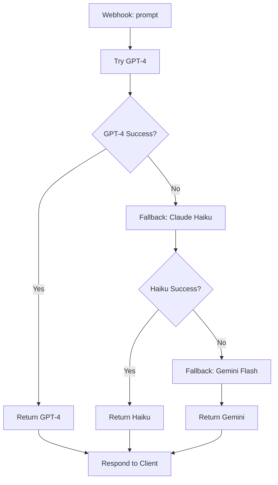

# Fallback Model on Error

## What It Does

This workflow tries GPT-4 first. If it fails (rate limit, auth error, timeout), it falls back to Claude Haiku. If that fails, it tries Gemini Flash. The response succeeds at the first available model, reducing failure rates and isolating you from any single provider's outages.

## Why It's Architecturally Interesting

Vendor lock-in is dangerous. This workflow demonstrates graceful degradation across three major model providers. By keeping fallbacks cheap (Haiku, Flash are tiny) and layering them, you maintain SLA compliance without paying for three parallel requests. It's the insurance policy for production AI systems.

## Node by Node

1. **Webhook In**: Accepts JSON with a `prompt` field.
2. **Initialize State**: Sets `current_model` to "gpt-4".
3. **Try GPT-4**: Calls OpenAI with the prompt.
4. **Check GPT-4**: If-node checks for error. On success, return. On error, fall through.
5. **Fallback to Claude Haiku**: HTTP request to Anthropic API with Haiku model.
6. **Check Haiku**: If success, return with model tag. On error, fall through.
7. **Fallback to Gemini Flash**: HTTP request to Google Generative AI with Gemini Flash.
8. **Success Gemini**: Format and return the Gemini response with model tag.

## Architecture Diagram



## Swap This For Your Stack

- Replace GPT-4 with OpenAI's GPT-4o or GPT-4 Turbo for different cost/quality tradeoffs.
- Swap Claude Haiku for Claude 3.5 Sonnet if budget allows (better quality, higher cost).
- Use Grok or Mistral as fallbacks instead of Gemini.
- Add local Ollama fallback as your final layer (zero API cost, but slower).
- Reorder by your preferred latency/cost/quality profile. If Claude is your primary, put it first.

## Cost Optimization Tips

- GPT-4 should be your primary if quality is critical and cost secondary.
- Haiku and Flash are both cheap. Only pay for one fallback if budget is very tight.
- Log which model was used to track fallback frequency. High fallback rates signal you should swap primaries.
- Use exponential backoff (1s, 2s, 4s) on rate limits before falling through to the next model.
- Cache the prompt in all three APIs to reduce token spend on retries.

## Testing

Send a POST with:
```json
{"prompt": "Explain quantum computing in one sentence"}
```

Under normal conditions, GPT-4 responds. Simulate GPT-4 being down by removing its credentials. The workflow automatically falls back to Haiku, then Gemini if needed.

## Error Handling

- Rate limit (429): Retry with backoff before fallback. Don't burn fallbacks on rate limits.
- Auth error (401): Check credentials; fallback won't help.
- Timeout: Fallback immediately to avoid user-facing delays.

Log all fallbacks for monitoring.
