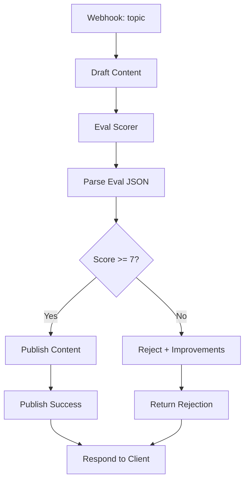

# Evaluation Gate Before Publish

## What It Does

This workflow drafts content, evaluates it against a rubric (relevance, clarity, completeness, originality), and only publishes if the score exceeds a threshold (default 7/10). Low-scoring content is rejected with improvement suggestions. Perfect for ensuring quality before shipping user-facing output.

## Why It's Architecturally Interesting

Eval gates are the secret sauce behind production AI systems. Most teams skip this and ship drafts directly. This workflow shows the pattern: draft, score, gate, publish. It applies learned quality standards consistently and prevents bad outputs from reaching users. Critical for retention and brand trust.

## Node by Node

1. **Webhook In**: Accepts JSON with a `topic` field.
2. **Draft Content**: GPT-4o-mini generates content based on the topic (temperature 0.7 for creativity).
3. **Eval Scorer**: GPT-4o-mini evaluates the draft against a 4-dimension rubric. Returns JSON: score, reasoning, improvements.
4. **Parse Eval JSON**: Code node parses the eval response.
5. **Quality Gate**: If-node checks if score >= 7.
6. **Publish Content**: HTTP POST to your publishing API with content, score, timestamp.
7. **Publish Success**: Tag the response with status "published" and the score.
8. **Reject (Low Quality)**: Return the draft with status "rejected_low_quality" and improvement suggestions.

## Architecture Diagram



## Swap This For Your Stack

- Replace Eval Scorer LLM with Claude 3.5 Sonnet (better at detailed criticism).
- Use a fine-tuned classifier instead of a generic LLM to score (faster, cheaper, more consistent).
- Swap the publish endpoint with your CMS, blog platform, or queue (Shopify, WordPress, SQS, etc.).
- Add human review as a second gate before publish if content is high-stakes (legal, medical).
- Implement appeal logic: if score is 6.5-7, send to human reviewer instead of auto-rejecting.

## Cost Optimization Tips

- Use gpt-3.5-turbo for both draft and eval (GPT-4o-mini is overkill; tests show 3.5T is competitive).
- Set eval temperature to 0.2 (deterministic scoring). Draft temperature can stay at 0.7.
- Cache the eval rubric in the prompt to avoid token reuse penalties.
- Batch eval operations (evaluate 10 drafts in one API call) if processing bulk content.
- Log rejection reasons to identify systematic issues. If 40% reject on "clarity", retrain the drafter prompt.

## Testing

Send a POST with:
```json
{"topic": "Why n8n is better than Zapier"}
```

Good output will score 8-9 and publish. Try a trivial topic:
```json
{"topic": "zzz"}
```

Should score low (2-3) and reject with suggestions to expand the topic.

## Monitoring

Track:
- Publish rate (% of drafts that pass the gate)
- Average scores (trend up over time if your drafter improves)
- Top rejection reasons (actionable feedback for prompt iteration)
- Time to publish (draft + eval + publish latency)

Alert if publish rate drops below your SLA.
