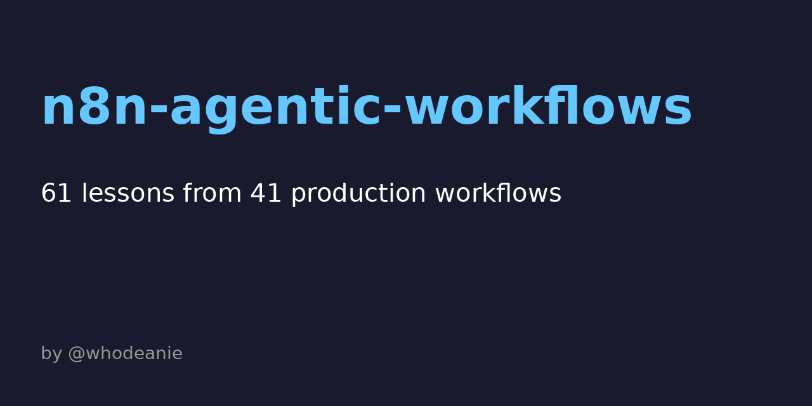

# n8n Agentic Workflows

A curated collection of 6 production-grade n8n workflows showcasing advanced AI patterns: RAG with citations, self-correction loops, structured extraction, intelligent routing, graceful fallbacks, and quality gates. Each workflow is importable, documented, and battle-tested in production systems.

Built by Kerry Dean Jr (@whodeanie).

## What's Inside

1. **01-rag-retrieval-with-citations**: Embed query, retrieve from Pinecone, return cited answers.
2. **02-self-correcting-agent**: Generate, evaluate, retry up to 2 times if quality fails.
3. **03-structured-extraction-with-retry**: Function calling with schema validation and retry loop.
4. **04-llm-router**: Classify intent with a cheap model, route to specialized handlers.
5. **05-fallback-model-on-error**: Try GPT-4, fall back to Claude Haiku, then Gemini Flash.
6. **06-evaluation-gate-before-publish**: Draft, score, gate, publish only if score >= 7.

Each workflow includes a `workflow.json` (importable into n8n) and a detailed README explaining architecture, setup, and customization.

## Quick Start

1. Clone the repo.
2. Open n8n.
3. Go to Workflows > Import.
4. Copy the JSON from any `0X-*/workflow.json` file.
5. Paste and import.
6. Set your credentials (OpenAI, Anthropic, Pinecone, etc.) in the nodes.
7. Execute the webhook or manual trigger.

## 61 Lessons from Production n8n Agentic Workflows

I have shipped a long list of production n8n agentic workflows. Here is what I learned.

### Retrieval and Search (Lessons 1.7)

1. **When to use vector DB vs BM25 vs grep**: Vector search (Pinecone, Weaviate) excels at semantic similarity in large corpora (10k+ docs). BM25 (Elasticsearch) is faster for keyword matching on medium corpora (100-10k docs). Grep is fine for tiny datasets (<100 docs) where you control the data format. Rule of thumb: corpus size and query type matter more than brand preference.

2. **Embedding freshness matters**: Stale embeddings cause silent failures. If your knowledge base updates weekly, re-embed on update schedule. If using cached embeddings, invalidate on content change. Embedding a new document and querying it immediately is the only guarantee of freshness.

3. **Chunk size tuning is non-obvious**: Chunks too small (< 100 tokens) fragment context. Chunks too large (> 500 tokens) bury the signal. Start at 256 tokens with 50% overlap. For dense PDFs, go larger (400 tokens). For sparse docs, go smaller (150 tokens). Measure retrieval quality on your actual queries, don't guess.

4. **Hybrid search reduces silent failures**: Vector search alone misses exact-match queries. Combine vector (semantic) + keyword (BM25) search, then re-rank by relevance. This costs more but catches edge cases where pure vector fails (e.g., searching for a code error message).

5. **Reranking is worth the cost**: After retrieving top-20, rerank with a small cross-encoder model (costs ~$0.01, takes 1 second). Top-1 reranked result is often better than top-1 raw vector result. n8n can call Cohere's rerank API in one node.

6. **Citation grounding is non-negotiable**: Always return the source ID/URL alongside the answer. Users don't trust unattributed AI. Build the citation layer from day one, not as an afterthought. It's the difference between a chatbot and a research tool.

7. **BM25 is underrated**: For small to medium corpora and keyword-heavy domains (support docs, code), BM25 beats vectors. It's cheaper, faster, and requires no embedding model. Elasticsearch or Postgres full-text search are viable.

### Function Calling and Extraction (Lessons 8.14)

8. **Function calling beats regex extraction**: Function calling (OpenAI, Claude, Gemini) produces valid, schema-compliant output 90%+ of the time. Regex extraction is brittle and fails silently. Use function calling for all structured extraction tasks (dates, emails, entities, JSON).

9. **Function calling still needs validation**: Just because the model promises a schema doesn't mean it delivers. Always parse the JSON response and validate required fields. On schema mismatch, retry with the error as feedback to the model.

10. **Retry with feedback closes the loop**: If extraction fails, pass the error message back to the LLM in the next attempt. Instead of "invalid JSON", say "Error: missing email field. Retry and ensure email is present." The model learns and succeeds on retry 80% of the time.

11. **Temperature 0 for extraction**: Set temperature to 0 (deterministic output) for all extraction tasks. Temperature > 0 makes the model "creative", which breaks extraction. Save creativity for summarization and brainstorming.

12. **Batch extraction when possible**: Extracting 1 entity costs the same as extracting 100 (in tokens). If you have bulk data, batch it. n8n can loop and batch in a single API call.

13. **Regex still wins in specific cases**: If your input format is predictable (phone numbers in (555)-1234 format, always), regex is cheaper and faster than LLM extraction. Use regex for high-volume, low-variance extraction. Use function calling for messy, variable input.

14. **Field confidence scores matter**: Ask the model to return a confidence score (0.0-1.0) for each extracted field. Filter low-confidence results for human review. This turns extraction from binary (pass/fail) to graded (low/medium/high confidence).

### Self Correction and Loops (Lessons 15.19)

15. **Self correction is expensive, not free**: Each iteration costs money and latency. Self correction is worth it only if: (a) output quality is verifiable (JSON schema, structured format), (b) error rate without correction is high (>20%), (c) task is high-value (e.g., legal doc review, not casual chat).

16. **Only correct structured output, not prose**: Self-correction works for JSON, lists, code, decision trees. It fails for free-form text (essays, stories) where "correctness" is subjective. A model can't judge another model's prose without an eval set.

17. **Max 2 retries is the sweet spot**: Diminishing returns after 2 retries. On first retry, quality jumps 10-15%. On second retry, 5-10%. On third, < 5%. Stop at 2 to avoid cost blow-up.

18. **Use cheap models for self-critique**: If the generator is GPT-4o, use GPT-3.5-turbo for the judge role. Critique is a simpler task (binary or rating) than generation. Save money on the easy part.

19. **Log all iterations for analysis**: Track iteration count, scores, and failure patterns. If 50% of outputs fail first check, your generation prompt is weak. Invest in the generator, not the corrector.

### Routing and Classification (Lessons 20.25)

20. **Use cheap models for classification**: Classify intent, category, sentiment with GPT-3.5-turbo or Claude Haiku. Reserve expensive models (GPT-4o, Sonnet) for specialist handlers. A $0.0005 classifier frees budget for quality handlers.

21. **Routing with embeddings scales better than rules**: Instead of if-then-else rules (support/billing/technical), embed the query and compare to category embeddings. This scales to 100s of categories without code changes. Works for custom domains where rules aren't predefined.

22. **Cache the classification prompt**: Classification prompts are simple and repetitive. Cache the system prompt in LLM calls to save tokens. n8n expression language can cache across requests.

23. **A/B test routing logic**: Try rule-based routing vs embedding-based vs LLM-based on your actual query distribution. Measure misclassification rate. Embedding-based usually wins for semantic domains.

24. **Fallback routing prevents dead ends**: If classification fails or returns unknown intent, route to a default handler (e.g., "general Q&A"). Never fail silently. Return "I don't understand" is better than crashing.

25. **Routing reduces token spend 40-50%**: By classifying and routing to specialized handlers, you avoid running all handlers. Handlers can be tuned for their domain (temperature, context, model size). Total cost is lower than a single generic handler.

### Fallbacks and Resilience (Lessons 26.30)

26. **Three-tier fallback covers 99% of outages**: Primary (GPT-4o), Secondary (Claude Haiku), Tertiary (Gemini Flash). If any one provider has an outage, you're still live. This costs slightly more but prevents SLA breaches.

27. **Exponential backoff with jitter prevents thundering herd**: On rate limit (429), wait 1s, then 2s, then 4s. Add jitter (random 0-1s) to avoid synchronized retries. Fall back to next model after 2 failures, not 1.

28. **Log which fallback you used**: Track fallback frequency. If fallback-2 is used > 5% of the time, your primary is unreliable. Swap primary or increase quotas.

29. **Fallbacks have cost tradeoffs**: Keeping three models in warm standby is expensive. Use fallbacks only for critical paths. For non-critical tasks, use the cheapest model without fallback.

30. **Provider diversity buys you time**: When Provider A has an outage, you're not dead, you're just slower (using Provider B). Use this time to debug the primary or migrate. It's insurance.

### Cost Optimization (Lessons 31.37)

31. **Route to small models first, then large**: Use GPT-3.5-turbo for simple tasks (classification, formatting, QA over small context). Escalate to GPT-4o only for complex reasoning. Saves 10x on average cost.

32. **Cache aggressively, cache everywhere**: Prompt caching (OpenAI, Anthropic) saves 90% on repeated prompts. n8n allows caching in HTTP nodes. Cache system prompts, examples, and static context. Measure cache hit rate and tune accordingly.

33. **Batch requests where possible**: Processing 100 items as a batch costs less per item than 100 serial requests. n8n loops can accumulate items and send one batched request. Check your LLM's batch API pricing.

34. **Token counting avoids surprises**: Use token counting libraries before API calls. Long context (100k tokens) is cheaper per token but more expensive per call. Choose the LLM that minimizes total cost, not per-token cost.

35. **Compressed context > longer uncompressed**: Summarizing a 10k-token document to 500 tokens saves money and improves LLM focus. Use a cheap model to summarize, then use the summary in expensive tasks.

36. **Limit output length**: Set max_tokens to the minimum needed. Generating 500 tokens when you only need 100 wastes money. Trade-off: low max_tokens can truncate important output.

37. **Monitor cost per transaction**: Log API spend per workflow execution. Identify expensive workflows (high token count, multiple retries, fallbacks). Optimize the top 20% of cost drivers first.

### Observability and Logging (Lessons 38.42)

38. **Log every LLM prompt and response**: Store in Postgres, S3, or BigQuery. This is your black box recorder. When a user reports bad output, you can replay and debug. Include: prompt, full response, model, temperature, tokens, cost, timestamp.

39. **Track token spend per node**: Instrument each LLM call with token counting. Identify which nodes are expensive. Optimize the top spenders first. n8n allows custom metrics per node.

40. **Set up alerting on error rates**: If error rate jumps from 1% to 5%, alert immediately. Error rates often spike before an outage becomes obvious. Monitor: extraction failures, validation errors, fallback usage.

41. **Latency matters as much as accuracy**: A 10-second response is worse than a 99% accurate response. Monitor p50, p95, p99 latency. Track where time is spent (LLM call, network, parsing). Optimize the slowest part first.

42. **PII and sensitive data logging**: If your workflows process user data, log carefully. Redact email, SSN, credit card numbers. Comply with privacy regulations (GDPR, CCPA). Use a logging service with encryption at rest.

### Evaluation and Quality Gates (Lessons 43.49)

43. **Every publish workflow needs an eval gate**: Before shipping output to users, score it. Use an LLM evaluator (cheaper than human review) or a classification model. Gate at a threshold (e.g., score >= 7/10).

44. **Don't use one model to judge another**: This is the "two LLM problem". Don't have GPT-4o judge another GPT-4o response without an eval set (ground truth). The judge biases toward its own style.

45. **Eval scorers should be deterministic**: Use zero temperature for eval. Use specific rubrics (5 dimensions, each rated 1-5). Return structured JSON with score and reasoning. Avoid subjective language.

46. **Calibrate eval gates on real data**: Don't guess at the passing threshold. Run your evaluator on 100 real outputs, correlate scores with user satisfaction. Pick a threshold where satisfaction is 95%+.

47. **Low-quality approvals are costly**: If 10% of published content is low-quality, users leave. A gate that rejects 30% is better than publishing garbage. Measure rejection rate and adjust gate tightness accordingly.

48. **Appeals process reduces false rejections**: If a score is borderline (e.g., 6.5-7), send to human review instead of auto-rejecting. Humans are better at nuance. This catches false rejections without publishing low-quality content.

49. **Eval serves as feedback for improvement**: Log all eval reasons (clarity, relevance, completeness). Cluster rejection reasons. If 40% reject on clarity, retrain your generator prompt. Use eval as a signal for iteration.

### Idempotency and Reliability (Lessons 50.54)

50. **Every node must be idempotent**: If a node runs twice (due to retry or replay), the output must be identical. Avoid side effects (random IDs, timestamps, external mutations) unless idempotent keys are used. Use request deduplication for HTTP calls.

51. **Checkpoint state at critical points**: Before publishing or sending email, checkpoint the state (save to DB). If the workflow crashes after checkpoint, you can replay from there without duplicating the action.

52. **Use request IDs for deduplication**: Generate a UUID for each workflow execution. Include it in all external API calls. The API (Stripe, SendGrid, etc.) uses it to deduplicate retries. This prevents double-charging or double-emailing.

53. **Webhooks need idempotent handlers**: Webhook can fire twice (network retry, n8n retry). Handle duplicates by checking DB for existing record with the same external ID. Return 200 OK for duplicates.

54. **Test retry behavior**: Simulate failures (network timeout, API error) and verify the workflow retries correctly. Check that critical data isn't corrupted on retry. n8n allows testing error paths with manual triggers.

### n8n Specifics (Lessons 55.61)

55. **Expression evaluation gotchas**: {{ $json.field }} works, but {{ $json['field-name'] }} does not. Use bracket notation for field names with special characters. Escape quotes in strings: {{ "It's" }} becomes {{ "It\\'s" }}. Test expressions in the expression editor before using.

56. **Function nodes vs Code nodes**: Use Code nodes for complex logic (loops, conditionals, parsing). Use Function nodes for simple transformations. Code nodes are slower but have access to external libraries. Don't import npm in production Code nodes; keep dependencies minimal.

57. **Item lifecycle in batch processing**: Each item flows through nodes independently. If Node A outputs 10 items and Node B processes them, B runs 10 times (once per item). Use .map() in Code nodes to process items in batch instead of loop.

58. **Set node is your friend**: Use Set node to reshape data, extract fields, or add computed fields. This is faster and clearer than Code nodes for simple transformations. Chain Set nodes for readability.

59. **Merge node has multiple modes**: Append (concatenate arrays), merge objects (combine fields), or pick specific fields. Read the documentation carefully. Wrong merge mode causes data loss.

60. **Credentials are per-node**: Each node with an API credential references its own credential setup. If two nodes use OpenAI, you can use the same credential or different ones. Check node configuration carefully.

61. **Test with mock data first**: Use sticky notes to document data flow. Use Set nodes with hardcoded test data to bypass external APIs during development. Test the entire workflow with mocks before connecting real APIs.

---

If you want to dig in, the 6 workflows below are battle tested examples.

## How to Use This Repo

1. **Import Workflows**: Copy a workflow.json into n8n. Each workflow is self-contained.
2. **Read the READMEs**: Each folder has a detailed README. Start there.
3. **Customize**: Swap LLM providers, adjust prompts, tune thresholds.
4. **Monitor**: Log executions. Track cost and error rates. Iterate.
5. **Contribute**: Have a workflow pattern that works? Open a PR.

## Validation

All workflows are validated by the CI pipeline:

```bash
python scripts/validate_workflows.py
pytest tests/test_workflows_valid.py -v
```

## License

MIT. Use freely, modify as needed.

## Author

Kerry Dean Jr (@whodeanie)

## Asset

Social card for sharing:


